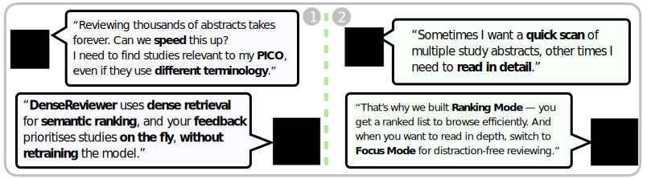
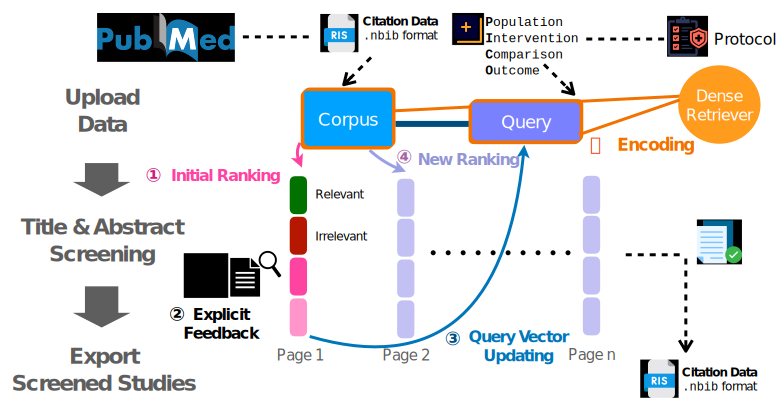

# DenseReviewer: A Screening Prioritisation Tool for Systematic Review based on Dense Retrieval

<p align="center">
| <a href="https://ielab.io/projects/systematic-reviews.html"><b>Project page</b></a> |
<a href="https://arxiv.org/abs/2407.00635"><b>Research Paper</b></a> |
 <a href="https://arxiv.org/abs/2502.03400"><b>Demo Paper</b></a>  | <a href="https://densereviewer.ielab.io/"><b>Website</b></a> |
</p>


<p align="center">
  
</p>

DenseReviewer is a screening prioritization tool for medical systematic reviews based on dense retrieval and relevance feedback. It helps medical researchers and librarians efficiently screen titles and abstracts of studies by prioritizing relevant ones using state-of-the-art dense retrieval methods.

## Features
<p align="center">
  
</p>


- **Dense Retrieval & Relevance Feedback**: Uses PICO queries and iteratively updates rankings based on screener feedback
- **Dual Screening Modes**: 
  - Ranking mode: View studies in a paginated ranked list
  - Focus mode: Review studies individually with keyboard controls
- **Real-time Progress Tracking**: Visual analytics showing review progress and relevance discovery curves


<p align="center">
  
</p>

## Installation

#### Prerequisites:
 [Docker](https://docs.docker.com/get-started/get-docker/) and [Docker Compose](https://docs.docker.com/compose/) (+ NVIDIA GPU & CUDA optional)

> **📢 RECOMMENDATION**: For best performance, use the GPU version with a compatible NVIDIA GPU on a cloud server.

#### Compatibility Checklist:

- [x] **Linux (x86_64)** – Tested ✅

- [x] **Windows (x86_64)** – Tested ✅

- [x] **macOS (Apple Silicon)** – Tested ✅

### 1. Get the Code

```bash
git clone https://github.com/ielab/densereviewer.git

cd densereviewer
```


### 2. Launch DenseReviewer

****GPU Users**** ✅ (Recommended):

```bash
# build the backend service with gpu support
docker compose -f docker-compose-gpu.yml build backend --no-cache

# start the app with gpu support
docker compose -f docker-compose-gpu.yml down && docker compose -f docker-compose-gpu.yml up -d
```

****CPU Users**** 🚧:

```bash
# Note: CPU version is currently being fixed
# build the backend service
docker-compose build backend --no-cache --build-arg BUILD_OS=$(uname -s)

# start the app
docker compose up -d
```


### Using the Python Library

The [Python library](https://github.com/ielab/dense-screening-feedback) from our research paper ["Dense Retrieval with Continuous Explicit Feedback for Systematic Review Screening Prioritisation"](https://dl.acm.org/doi/10.1145/3626772.3657921) supports experiments with customized dense retrievers and relevance feedback methods.

## System Architecture

DenseReviewer consists of six Docker containers:
1. Web-based front end
2. REST API backend
3. Database for storing user activity and corpus data
4. Message broker for task queues
5. Service for parsing, encoding, and initial ranking
6. Service for handling re-ranking

## License

This project is licensed under the GNU Affero General Public License v3.0 (AGPL-3.0) with additional clauses - see the [LICENSE](LICENSE) file for details.

## Acknowledgments

We extend our gratitude to the engineering team of AI DETA Technologies Co. for their consultation and support in developing DenseReviewer.


## Citation

If you find this repo useful for your research, please kindly cite the following paper:
```bibtex
@inproceedings{2025maodensereviewer,
author       = {Xinyu Mao and Teerapong Leelanupab and Harrisen Scells and Guido Zuccon},
title        = {DenseReviewer: A Screening Prioritisation Tool for Systematic Review Based on Dense Retrieval},
booktitle.   = {European Conference on Information Retreival},
series       = {ECIR '25},
publisher    = {Springer},
year         = {2025},
doi          = {10.1007/978-3-031-88720-8\_11}
}
```

## Contact

For questions and feedback, please open an issue on GitHub or contact the authors directly.